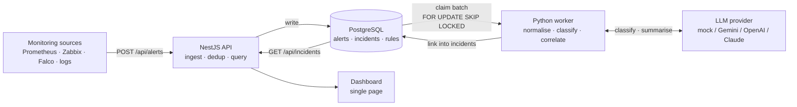
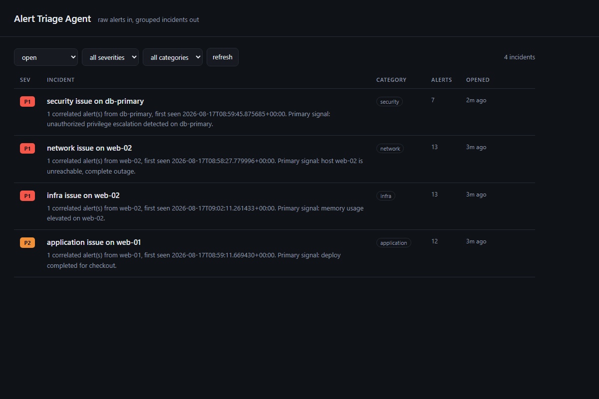

# Alert Triage Agent

Monitoring systems produce alerts. Humans need incidents.

This service sits between the two: it ingests raw alerts from any source, normalises wildly different payload shapes into one schema, classifies each alert with an LLM, and correlates related alerts into a single incident. A hundred alerts on a bad afternoon become five things a person actually has to look at.

Runs end to end with **no API key** - the default provider is a deterministic offline classifier, so `docker compose up` gives you a working demo immediately.

```
NestJS + TypeScript   ·   PostgreSQL 16   ·   Python 3.12 worker   ·   Docker Compose
```

---

## Architecture



Ingestion is write-only and fast. Classification happens out of band, so a burst of a thousand alerts never blocks on a model call.

---

## Quick start

```bash
git clone https://github.com/DmytroSup/alert-triage-agent.git
cd alert-triage-agent
cp .env.example .env          # every default works as-is
docker compose up --build     # postgres + api + worker
python db/seed/send_alerts.py --count 60
open http://localhost:3000
```

Within a few seconds the dashboard shows the 60 alerts collapsed into a handful of incidents.



**Without Docker:** start a local PostgreSQL, apply `db/init/001_schema.sql`, then run `npm install && npm run start:dev` in `apps/api` and `pip install -r requirements.txt && python main.py` in `apps/worker`.

---

## How correlation works

Correlation rules live in the `correlation_rules` table, not in code, so behaviour changes without a redeploy.

| Rule | Window | Matches on |
|---|---|---|
| `same-host-same-category` | 15 min | category + host |
| `same-service-any` | 30 min | service |
| `category-wide-fallback` | 10 min | category |

Rules are tried narrowest-window first. For each rule the worker builds a correlation key from the alert's normalised fields and looks for an open incident whose alerts share that key. First match wins; if nothing matches, a new incident is opened and the LLM writes its title and summary.

Two details that matter:

- **A missing field becomes an empty key segment rather than being skipped.** Otherwise two alerts that each lack a different field would collapse into one incident.
- **An incident is as severe as its worst alert, never less.** A P1 arriving into a P3 incident escalates it.

---

## Deliberate trade-offs

**No ORM.** The two most interesting pieces of this project are the `JOIN` that assembles an incident view and the transaction that links an alert to an incident while bumping its counters. An ORM would hide both behind generated SQL. `pg` and `psycopg2` keep the queries readable in `apps/api/src/*/*.service.ts` and `apps/worker/db.py`.

**PostgreSQL as the queue.** `SELECT ... FOR UPDATE SKIP LOCKED` lets several worker replicas drain the same table without stepping on each other. For this volume that is correct and it removes Redis or Kafka from the dependency list. At a much higher ingest rate it would be the first thing to replace.

**Offline mock provider by default.** A portfolio project nobody can run is a portfolio project nobody reads. The mock is an honest keyword classifier, not a model pretending to be one - swap `LLM_PROVIDER` to see the difference.

**Dedup at ingest, correlation in the worker.** Dedup is a cheap fingerprint lookup and belongs on the hot path. Correlation needs the classification result, so it cannot happen until the model has answered.

---

## API

| Method | Path | Purpose |
|---|---|---|
| `POST` | `/api/alerts` | Ingest one alert. `202` accepted or deduplicated, `400` invalid |
| `GET` | `/api/alerts/stats` | Queue depth and processing counters |
| `GET` | `/api/alerts/:id` | One alert with its classification and incident link |
| `GET` | `/api/incidents` | List, filterable by `status`, `severity`, `category` |
| `GET` | `/api/incidents/summary` | Aggregate counters |
| `GET` | `/api/incidents/:id` | One incident with every alert rolled into it |
| `PATCH` | `/api/incidents/:id/status` | `open` · `acknowledged` · `closed` |

Ingestion accepts any JSON under `payload`. Only `source` and `payload` are required - mapping vendor field names is the normaliser's job, not the caller's.

```bash
curl -X POST localhost:3000/api/alerts \
  -H 'content-type: application/json' \
  -d '{"source":"zabbix","payload":{"host":"web-01","severity":"critical","message":"disk usage exceeded 95%"}}'
```

Set `INGEST_API_KEY` and every ingest must carry a matching `x-api-key` header. Left empty, the guard stays open so the demo works out of the box.

---

## Testing

A full walkthrough is in [`docs/TESTING.md`](docs/TESTING.md), including a ready-made Postman collection in [`postman/`](postman/).

All three layers - offline unit tests, correlation SQL against a real database, and the full HTTP pipeline with a live worker - have been run end to end; see [`docs/PROGRESS.md`](docs/PROGRESS.md) for the results.

```bash
# Pure-logic tests: normalisation and classification, no database, no network
cd apps/worker && python -m unittest discover -s tests -v

# Correlation SQL against a real PostgreSQL, wrapped in a transaction
psql "$DATABASE_URL" -v ON_ERROR_STOP=1 -f db/verify_correlation.sql
```

`verify_correlation.sql` feeds five alerts through the exact statements the worker issues and asserts the result: three incidents, one of them grouping three alerts and escalated from P2 to P1. CI runs all three suites on every push.

---

## Configuration

Everything has a working default. See [`.env.example`](.env.example) for the full list.

| Variable | Default | Notes |
|---|---|---|
| `LLM_PROVIDER` | `mock` | `mock` · `gemini` · `openai` · `anthropic` |
| `DEDUP_WINDOW_SEC` | `300` | Identical fingerprints inside this window count once |
| `WORKER_BATCH_SIZE` | `20` | Alerts claimed per loop |
| `INGEST_API_KEY` | empty | Empty disables the guard |

Adding a provider means implementing `classify` and `summarize` in `apps/worker/llm/` and registering it in `get_provider()`. Each provider talks to its REST API directly, so there are no vendor SDKs in `requirements.txt`.

---

## Deploying

`render.yaml` deploys the same Dockerfiles to [Render](https://render.com) - a free API service, a free Postgres instance, and a paid ($7/mo) background worker, since Render has no free tier for workers. Walkthrough, cost breakdown and the one manual step (Render can't auto-apply the schema the way `docker compose` does) are in [`docs/DEPLOYMENT.md`](docs/DEPLOYMENT.md).

## Project layout

```
apps/api/       NestJS: ingestion, queries, static dashboard
apps/worker/    Python: normaliser, classifier, correlator, LLM providers
db/init/        Schema, applied automatically on first container boot
db/seed/        Synthetic alert generator that posts through the real API
postman/        Importable collection walking the whole pipeline
docs/           Testing guide, deployment guide, and development log
render.yaml     Render Blueprint for a public deployment
```

---

## Roadmap

- Webhook receivers for Alertmanager and Grafana so no adapter is needed
- Feedback loop: a human re-categorising an incident becomes a few-shot example
- Suppression windows for planned maintenance
- Prometheus metrics on triage latency and grouping ratio

## License

MIT
